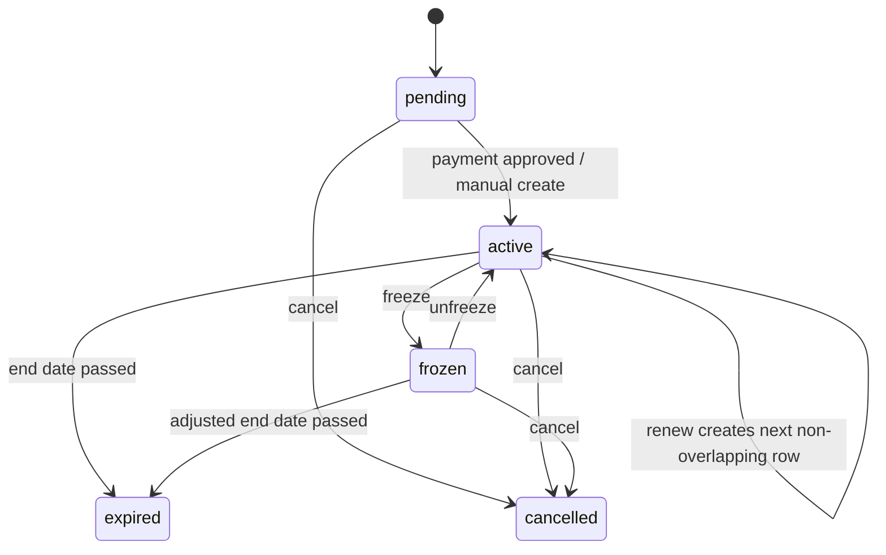

# Dababa Phase 1A Schema Proposal

This document proposes the database, RLS, permission, storage, audit, deletion/export, and threat-model design for Dababa. It is a proposal only: no migrations are implemented in Phase 1A.

## Principles

- Tenant isolation is enforced in Postgres with RLS on every `public` table.
- Every club-owned or club-scoped record carries `club_id`.
- One person has one global `profile`; membership in a club is represented by `club_members`.
- Server code must authenticate, authorize, validate, then act. The database repeats the authorization check for tenant isolation.
- Money is stored as integer minor units.
- Time values are stored as `timestamptz` in UTC and displayed in `Africa/Cairo`.
- User-facing deletes are soft deletes where business history matters; account deletion is a separate hard-delete/export workflow.
- Views must be created with `security_invoker = true`.
- Migrations must revoke default privileges from `anon` and `authenticated` on tables, sequences, and functions, then grant explicitly.
- Realtime stays disabled for now; no tables are published until a later phase explicitly opts in.

## Enums

| Enum | Values |
|---|---|
| `club_status` | `active`, `suspended`, `archived` |
| `member_status` | `active`, `inactive`, `suspended`, `left` |
| `staff_status` | `temp_password_pending`, `active`, `suspended`, `removed` |
| `subscription_status` | `pending`, `active`, `frozen`, `expired`, `cancelled` |
| `payment_method` | `cash`, `wallet_transfer`, `instapay_transfer`, `bank_transfer`, `manual_adjustment` |
| `payment_status` | `pending`, `approved`, `rejected`, `refunded` |
| `attendance_method` | `qr`, `manual_member_number`, `manual_phone` |
| `attendance_result` | `accepted`, `duplicate`, `expired_subscription`, `frozen_subscription`, `wrong_club`, `invalid_token`, `not_found` |
| `plan_assignment_status` | `active`, `paused`, `completed`, `cancelled` |
| `notification_channel` | `in_app`, `web_push` |
| `notification_status` | `queued`, `sent`, `read`, `failed` |
| `audit_severity` | `info`, `warning`, `critical` |
| `record_source` | `member`, `staff` |

## Extensions

- `pgcrypto` for `gen_random_uuid()`.
- `btree_gist` for exclusion constraints on date ranges.
- `pg_trgm` for member search.
- `pgtap` for DB tests.

## Tables

### `profiles`

Global account profile linked to Supabase Auth.

| Column | Type | Constraints |
|---|---|---|
| `id` | `uuid` | PK, references `auth.users(id)` on delete cascade |
| `email` | `citext` | nullable, unique where not null |
| `phone_e164` | `text` | nullable, normalized E.164 for contact only, not unique platform-wide |
| `full_name_ar` | `text` | not null |
| `full_name_en` | `text` | nullable |
| `avatar_path` | `text` | nullable |
| `preferred_locale` | `text` | not null default `ar`, check in `('ar','en')` |
| `timezone` | `text` | not null default `Africa/Cairo` |
| `deleted_at` | `timestamptz` | nullable |
| `created_at` | `timestamptz` | not null default `now()` |
| `updated_at` | `timestamptz` | not null default `now()` |

Indexes:
- unique lower email where `email is not null`.
- `profiles_deleted_at_idx`.

Tenant scoped: no.

### `platform_admins`

Separate platform administrator registry. Platform admin status is not stored on `profiles`.

| Column | Type | Constraints |
|---|---|---|
| `profile_id` | `uuid` | PK, references `profiles(id)` on delete cascade |
| `granted_by` | `uuid` | nullable references `profiles(id)` |
| `mfa_required` | `boolean` | not null default true |
| `created_at` | `timestamptz` | not null default `now()` |
| `revoked_at` | `timestamptz` | nullable |

Rules:
- Writable only by migrations or a protected super-admin function.
- Super admin access requires a live platform admin row and MFA verified in the current session.
- All super admin tenant reads are audited.

Tenant scoped: no.

### `platform_plans`

Dababa platform plans for clubs. These are not member packages; member packages remain `membership_plans`.

| Column | Type | Constraints |
|---|---|---|
| `id` | `uuid` | PK default `gen_random_uuid()` |
| `code` | `text` | not null unique |
| `name_ar` | `text` | not null |
| `name_en` | `text` | not null |
| `max_staff` | `integer` | nullable means unlimited, check `> 0` when not null |
| `max_members` | `integer` | nullable means unlimited, check `> 0` when not null |
| `min_monthly_fee_minor` | `integer` | not null default 0, check `>= 0` |
| `allowed_modules` | `text[]` | not null, constrained to `core`, `nutrition`, `notifications`, `csv_import`, `attendance_scanner` |
| `is_active` | `boolean` | not null default true |
| `created_at` | `timestamptz` | not null default `now()` |
| `updated_at` | `timestamptz` | not null default `now()` |

Seed:
- One default plan allows all currently available modules, with unlimited limits unless the project owner approves stricter launch limits.

Tenant scoped: no.

### `platform_plan_prices`

Versioned per-active-member prices for future billing. Nothing bills in current scope.

| Column | Type | Constraints |
|---|---|---|
| `id` | `uuid` | PK default `gen_random_uuid()` |
| `platform_plan_id` | `uuid` | not null references `platform_plans(id)` |
| `price_per_active_member_minor` | `integer` | not null check `>= 0` |
| `currency` | `char(3)` | not null default `EGP` |
| `effective_from` | `date` | not null |
| `created_by` | `uuid` | not null references `profiles(id)` |
| `created_at` | `timestamptz` | not null default `now()` |

Constraints:
- unique `(platform_plan_id, effective_from)`.
- price changes never mutate prior rows.

Tenant scoped: no.

### `clubs`

Top-level tenant.

| Column | Type | Constraints |
|---|---|---|
| `id` | `uuid` | PK default `gen_random_uuid()` |
| `slug` | `text` | not null unique, lowercase slug check |
| `status` | `club_status` | not null default `active` |
| `platform_plan_id` | `uuid` | not null references `platform_plans(id)` |
| `trial_started_at` | `timestamptz` | nullable |
| `trial_ends_at` | `timestamptz` | nullable |
| `created_by` | `uuid` | references `profiles(id)` |
| `created_at` | `timestamptz` | not null default `now()` |
| `updated_at` | `timestamptz` | not null default `now()` |
| `suspended_at` | `timestamptz` | nullable |
| `archived_at` | `timestamptz` | nullable |

Indexes:
- `clubs_status_idx`.

Tenant scoped: tenant root, no parent `club_id`.

### `club_plan_history`

Manual plan/trial changes by super admins.

| Column | Type | Constraints |
|---|---|---|
| `id` | `uuid` | PK default `gen_random_uuid()` |
| `club_id` | `uuid` | not null references `clubs(id)` |
| `from_platform_plan_id` | `uuid` | nullable references `platform_plans(id)` |
| `to_platform_plan_id` | `uuid` | not null references `platform_plans(id)` |
| `from_trial_ends_at` | `timestamptz` | nullable |
| `to_trial_ends_at` | `timestamptz` | nullable |
| `changed_by` | `uuid` | not null references `profiles(id)` |
| `reason` | `text` | not null |
| `created_at` | `timestamptz` | not null default `now()` |

Rules:
- Only super admins can change plan or trial values.
- Owners can read their club plan, trial status, usage, and history summary, but cannot change any of it.
- During trial, the club has the entitlements of the assigned plan; metering continues but no billing happens.
- Trial expiry enforcement is a future design decision; Phase 1B only stores fields and policy boundaries.

Tenant scoped: yes.

### `usage_snapshots`

Daily append-only usage snapshots for future billing and owner usage displays.

| Column | Type | Constraints |
|---|---|---|
| `id` | `uuid` | PK default `gen_random_uuid()` |
| `club_id` | `uuid` | not null references `clubs(id)` |
| `snapshot_date` | `date` | not null |
| `active_member_count` | `integer` | not null check `>= 0` |
| `staff_count` | `integer` | not null check `>= 0` |
| `created_by` | `uuid` | nullable references `profiles(id)` |
| `created_at` | `timestamptz` | not null default `now()` |

Constraints:
- unique `(club_id, snapshot_date)`.
- append-only; only the scheduled job and super admins can write.

Definition:
- Platform billing/metering "active member" means `club_members.status = 'active'` and at least one subscription valid on `snapshot_date`.
- A person in several clubs counts once per club.
- A member with active club membership but expired subscription is not counted for platform metering, even though the club may still read member-owned data under the member-owned data rule.
- Snapshot job is idempotent and runs once per day; reruns for the same `(club_id, snapshot_date)` update nothing or no-op through conflict handling.

Tenant scoped: yes.

### `club_settings`

One row per club.

| Column | Type | Constraints |
|---|---|---|
| `club_id` | `uuid` | PK, references `clubs(id)` on delete cascade |
| `name_ar` | `text` | not null |
| `name_en` | `text` | not null |
| `logo_path` | `text` | nullable |
| `accent_color` | `text` | nullable, hex color check |
| `member_photo_required` | `boolean` | not null default false |
| `require_member_phone` | `boolean` | not null default true |
| `gym_module_enabled` | `boolean` | not null default true |
| `nutrition_module_enabled` | `boolean` | not null default false |
| `notifications_module_enabled` | `boolean` | not null default false |
| `csv_import_enabled` | `boolean` | not null default false |
| `attendance_scanner_enabled` | `boolean` | not null default true |
| `transfer_instructions_ar` | `text` | nullable |
| `transfer_instructions_en` | `text` | nullable |
| `created_at` | `timestamptz` | not null default `now()` |
| `updated_at` | `timestamptz` | not null default `now()` |

Tenant scoped: yes, `club_id`.

Module enablement must be checked against `club_entitlement(club_id, key)` in the protected update function, not only in the UI.

### `roles`

Club role definitions and role templates.

| Column | Type | Constraints |
|---|---|---|
| `id` | `uuid` | PK default `gen_random_uuid()` |
| `club_id` | `uuid` | not null references `clubs(id)` on delete cascade |
| `key` | `text` | not null |
| `name_ar` | `text` | not null |
| `name_en` | `text` | not null |
| `is_system` | `boolean` | not null default false |
| `created_at` | `timestamptz` | not null default `now()` |

Constraints:
- unique `(club_id, key)`.
- role template keys include `owner`, `member`, `trainer`, `reception`, `accountant`, and `manager`.
- custom permission tweaks create or update club-scoped roles; no platform/global role rows are needed.

Tenant scoped: yes.

### `permissions`

Permission registry.

| Column | Type | Constraints |
|---|---|---|
| `id` | `uuid` | PK default `gen_random_uuid()` |
| `key` | `text` | not null unique |
| `description` | `text` | not null |
| `created_at` | `timestamptz` | not null default `now()` |

Tenant scoped: no.

### `role_permissions`

Many-to-many role permission assignment.

| Column | Type | Constraints |
|---|---|---|
| `role_id` | `uuid` | references `roles(id)` on delete cascade |
| `permission_id` | `uuid` | references `permissions(id)` on delete cascade |
| `created_at` | `timestamptz` | not null default `now()` |

Constraints:
- PK `(role_id, permission_id)`.

Tenant scoped: inherited through `roles.club_id`.

### `club_members`

Membership/relationship between a profile and a club.

| Column | Type | Constraints |
|---|---|---|
| `id` | `uuid` | PK default `gen_random_uuid()` |
| `club_id` | `uuid` | not null references `clubs(id)` on delete restrict |
| `profile_id` | `uuid` | not null references `profiles(id)` on delete cascade |
| `member_number` | `text` | not null |
| `phone_e164` | `text` | nullable, normalized E.164, validated on input |
| `role_id` | `uuid` | not null references `roles(id)` |
| `status` | `member_status` | not null default `active` |
| `staff_status` | `staff_status` | nullable |
| `temp_password_required` | `boolean` | not null default false |
| `temp_password_issued_at` | `timestamptz` | nullable |
| `temp_password_expires_at` | `timestamptz` | nullable |
| `sessions_revoked_at` | `timestamptz` | nullable |
| `joined_at` | `timestamptz` | not null default `now()` |
| `left_at` | `timestamptz` | nullable |
| `deactivated_at` | `timestamptz` | nullable |
| `created_by` | `uuid` | nullable references `profiles(id)` |
| `created_at` | `timestamptz` | not null default `now()` |
| `updated_at` | `timestamptz` | not null default `now()` |

Constraints:
- unique `(club_id, profile_id)` where `left_at is null`.
- unique `(club_id, member_number)`.
- unique `(club_id, phone_e164)` where `phone_e164 is not null`; there is no platform-wide phone uniqueness.
- role must belong to same `club_id` or be an allowed system member role.
- a user cannot update their own `role_id`.
- staff cannot edit their own role or permissions.
- a non-owner staff member cannot edit an owner.
- a creator can grant only permissions they already hold.

Indexes:
- `(profile_id, status)`.
- `(club_id, status)`.
- trigram index on member number and joined profile names through a search view or generated search column.

Tenant scoped: yes.

### `staff_link_requests`

Pending link requests when a staff account email already belongs to an existing profile. There are no email invitations.

| Column | Type | Constraints |
|---|---|---|
| `id` | `uuid` | PK default `gen_random_uuid()` |
| `club_id` | `uuid` | not null references `clubs(id)` |
| `email` | `citext` | not null |
| `role_id` | `uuid` | not null references `roles(id)` |
| `permission_overrides` | `jsonb` | not null default `{}` |
| `requested_by` | `uuid` | not null references `profiles(id)` |
| `target_profile_id` | `uuid` | nullable references `profiles(id)` |
| `expires_at` | `timestamptz` | not null |
| `accepted_at` | `timestamptz` | nullable |
| `declined_at` | `timestamptz` | nullable |
| `cancelled_at` | `timestamptz` | nullable |
| `created_at` | `timestamptz` | not null default `now()` |

Tenant scoped: yes.

Staff account creation rules:
- Owner or a user with `staff.manage` enters full name, login email, role template, and optional permission tweaks.
- The server uses a narrowly scoped service-role server function; permission is re-checked inside the function.
- The function takes `club_id` from the authenticated active-club session, never from request body.
- If the email is new, Supabase Auth creates the account with a random temporary password shown once to the creator.
- Fake or placeholder email domains are not allowed.
- First login with a temporary password is restricted to the change-password screen until changed.
- If the email already exists, no account is created and no enumeration signal is leaked; a `staff_link_requests` row is created for in-app acceptance.
- Reset, suspend, and remove staff revoke existing sessions, are audited, and are rate-limited.
- Tests must cover temp-password lifecycle, forced change, enumeration resistance, privilege escalation, and session revocation.

### `membership_plans`

Club packages.

| Column | Type | Constraints |
|---|---|---|
| `id` | `uuid` | PK default `gen_random_uuid()` |
| `club_id` | `uuid` | not null references `clubs(id)` |
| `name_ar` | `text` | not null |
| `name_en` | `text` | not null |
| `duration_months` | `integer` | nullable, check `> 0` |
| `duration_days` | `integer` | nullable, check `> 0` |
| `price_minor` | `integer` | not null check `>= 0` |
| `currency` | `char(3)` | not null default `EGP` |
| `max_freeze_days` | `integer` | not null default 0, check `>= 0` |
| `max_freeze_count` | `integer` | not null default 0, check `>= 0` |
| `is_active` | `boolean` | not null default true |
| `created_at` | `timestamptz` | not null default `now()` |
| `updated_at` | `timestamptz` | not null default `now()` |

Constraints:
- exactly one of `duration_months` or `duration_days` must be non-null.

Tenant scoped: yes.

Freeze policy:
- Staff with `subscriptions.freeze` can freeze within the package limits.
- Exceeding `max_freeze_days` or `max_freeze_count` requires owner permission, a mandatory reason, and an audit entry.
- A freeze extends `subscriptions.ends_on` by the exact number of frozen Cairo calendar days.
- Boundary tests must cover within limit, at limit, over limit with staff denial, over limit with owner approval, and leap/month-end edges.

### `subscriptions`

Member subscription periods.

| Column | Type | Constraints |
|---|---|---|
| `id` | `uuid` | PK default `gen_random_uuid()` |
| `club_id` | `uuid` | not null references `clubs(id)` |
| `club_member_id` | `uuid` | not null references `club_members(id)` |
| `membership_plan_id` | `uuid` | nullable references `membership_plans(id)` |
| `status` | `subscription_status` | not null |
| `starts_on` | `date` | not null |
| `ends_on` | `date` | not null |
| `frozen_from` | `date` | nullable |
| `frozen_until` | `date` | nullable |
| `cancelled_at` | `timestamptz` | nullable |
| `created_by` | `uuid` | nullable references `profiles(id)` |
| `created_at` | `timestamptz` | not null default `now()` |
| `updated_at` | `timestamptz` | not null default `now()` |

Constraints:
- `ends_on >= starts_on`.
- `daterange(starts_on, ends_on + 1, '[)')` exclusion preventing overlap per `club_member_id` for statuses `pending`, `active`, `frozen`.
- end dates are computed as end-of-day in `Africa/Cairo` for display and validity checks; persisted columns remain `date` plus tested Cairo-boundary conversion.

Indexes:
- `(club_id, status, ends_on)`.
- `(club_member_id, starts_on desc)`.

Tenant scoped: yes.

### `subscription_freezes`

Freeze events for subscription history and limit tracking.

| Column | Type | Constraints |
|---|---|---|
| `id` | `uuid` | PK default `gen_random_uuid()` |
| `club_id` | `uuid` | not null references `clubs(id)` |
| `subscription_id` | `uuid` | not null references `subscriptions(id)` |
| `starts_on` | `date` | not null |
| `ends_on` | `date` | not null |
| `days_count` | `integer` | not null check `> 0` |
| `exceeds_plan_limit` | `boolean` | not null default false |
| `reason` | `text` | nullable; required when exceeding plan limit |
| `approved_by` | `uuid` | nullable references `profiles(id)` |
| `created_by` | `uuid` | not null references `profiles(id)` |
| `created_at` | `timestamptz` | not null default `now()` |

Constraints:
- `ends_on >= starts_on`.
- no overlapping freezes per subscription.

Tenant scoped: yes.

### `payments`

Cash and proof-of-payment records.

| Column | Type | Constraints |
|---|---|---|
| `id` | `uuid` | PK default `gen_random_uuid()` |
| `club_id` | `uuid` | not null references `clubs(id)` |
| `club_member_id` | `uuid` | not null references `club_members(id)` |
| `membership_plan_id` | `uuid` | nullable references `membership_plans(id)` |
| `subscription_id` | `uuid` | nullable references `subscriptions(id)` |
| `method` | `payment_method` | not null |
| `status` | `payment_status` | not null default `pending` |
| `amount_minor` | `integer` | not null check `amount_minor >= 0` |
| `currency` | `char(3)` | not null default `EGP` |
| `reference` | `text` | nullable |
| `proof_path` | `text` | nullable |
| `rejection_reason` | `text` | nullable |
| `reviewed_by` | `uuid` | nullable references `profiles(id)` |
| `reviewed_at` | `timestamptz` | nullable |
| `idempotency_key` | `uuid` | nullable |
| `recorded_by` | `uuid` | nullable references `profiles(id)` |
| `voided_by` | `uuid` | nullable references `profiles(id)` |
| `voided_at` | `timestamptz` | nullable |
| `void_reason` | `text` | nullable |
| `refunded_by` | `uuid` | nullable references `profiles(id)` |
| `created_at` | `timestamptz` | not null default `now()` |
| `updated_at` | `timestamptz` | not null default `now()` |
| `refunded_at` | `timestamptz` | nullable |

Constraints:
- unique `(club_id, idempotency_key)` where `idempotency_key is not null`.
- proof path required for transfer methods.
- `reviewed_by/reviewed_at` required when approved or rejected.
- cash payments are approved immediately when recorded by staff with `payments.record`.
- `amount_minor`, `currency`, `method`, `club_member_id`, and `membership_plan_id` are immutable after insert.
- corrections happen only through void/refund with mandatory reason by owner or accountant.

Tenant scoped: yes.

### `attendance`

Entry attempts and accepted visits.

| Column | Type | Constraints |
|---|---|---|
| `id` | `uuid` | PK default `gen_random_uuid()` |
| `club_id` | `uuid` | not null references `clubs(id)` |
| `club_member_id` | `uuid` | nullable references `club_members(id)` |
| `scanned_by` | `uuid` | nullable references `profiles(id)` |
| `method` | `attendance_method` | not null |
| `result` | `attendance_result` | not null |
| `qr_jti` | `uuid` | nullable |
| `occurred_at` | `timestamptz` | not null default `now()` |
| `dedupe_key` | `text` | nullable |
| `notes` | `text` | nullable |

Constraints:
- unique `(club_id, club_member_id, dedupe_key)` where `dedupe_key is not null`.
- unique `(club_id, qr_jti)` where `qr_jti is not null` to prevent token replay.

Tenant scoped: yes.

### `exercises`

Club exercise library.

| Column | Type | Constraints |
|---|---|---|
| `id` | `uuid` | PK default `gen_random_uuid()` |
| `club_id` | `uuid` | not null references `clubs(id)` |
| `name_ar` | `text` | not null |
| `name_en` | `text` | not null |
| `muscle_group` | `text` | not null |
| `equipment` | `text` | nullable |
| `description_ar` | `text` | nullable |
| `description_en` | `text` | nullable |
| `media_url` | `text` | nullable |
| `is_active` | `boolean` | not null default true |
| `created_at` | `timestamptz` | not null default `now()` |
| `updated_at` | `timestamptz` | not null default `now()` |

Tenant scoped: yes.

### `training_plans`

Club-owned plan templates or concrete plans.

| Column | Type | Constraints |
|---|---|---|
| `id` | `uuid` | PK default `gen_random_uuid()` |
| `club_id` | `uuid` | not null references `clubs(id)` |
| `name_ar` | `text` | not null |
| `name_en` | `text` | not null |
| `description` | `text` | nullable |
| `is_template` | `boolean` | not null default false |
| `created_by` | `uuid` | references `profiles(id)` |
| `created_at` | `timestamptz` | not null default `now()` |
| `updated_at` | `timestamptz` | not null default `now()` |

Tenant scoped: yes.

### `training_days`

Days inside a training plan.

| Column | Type | Constraints |
|---|---|---|
| `id` | `uuid` | PK default `gen_random_uuid()` |
| `club_id` | `uuid` | not null references `clubs(id)` |
| `training_plan_id` | `uuid` | not null references `training_plans(id)` on delete cascade |
| `day_number` | `integer` | not null check `> 0` |
| `title_ar` | `text` | not null |
| `title_en` | `text` | not null |
| `sort_order` | `integer` | not null default 0 |

Constraints:
- unique `(training_plan_id, day_number)`.

Tenant scoped: yes.

### `plan_exercises`

Exercise prescription inside a day.

| Column | Type | Constraints |
|---|---|---|
| `id` | `uuid` | PK default `gen_random_uuid()` |
| `club_id` | `uuid` | not null references `clubs(id)` |
| `training_day_id` | `uuid` | not null references `training_days(id)` on delete cascade |
| `exercise_id` | `uuid` | not null references `exercises(id)` |
| `sets` | `integer` | not null check `> 0` |
| `reps_min` | `integer` | nullable check `> 0` |
| `reps_max` | `integer` | nullable check `> 0` |
| `target_weight_minor` | `integer` | nullable check `>= 0` |
| `rest_seconds` | `integer` | nullable check `>= 0` |
| `notes_ar` | `text` | nullable |
| `notes_en` | `text` | nullable |
| `sort_order` | `integer` | not null default 0 |

Tenant scoped: yes.

### `plan_assignments`

Assigns a club training plan to a member.

| Column | Type | Constraints |
|---|---|---|
| `id` | `uuid` | PK default `gen_random_uuid()` |
| `club_id` | `uuid` | not null references `clubs(id)` |
| `club_member_id` | `uuid` | not null references `club_members(id)` |
| `training_plan_id` | `uuid` | not null references `training_plans(id)` |
| `status` | `plan_assignment_status` | not null default `active` |
| `starts_on` | `date` | not null |
| `ends_on` | `date` | nullable |
| `assigned_by` | `uuid` | not null references `profiles(id)` |
| `created_at` | `timestamptz` | not null default `now()` |
| `updated_at` | `timestamptz` | not null default `now()` |

Indexes:
- `(club_member_id, status, starts_on desc)`.

Tenant scoped: yes.

### `nutrition_plans`

Club-owned nutrition plan.

| Column | Type | Constraints |
|---|---|---|
| `id` | `uuid` | PK default `gen_random_uuid()` |
| `club_id` | `uuid` | not null references `clubs(id)` |
| `name_ar` | `text` | not null |
| `name_en` | `text` | not null |
| `description` | `text` | nullable |
| `is_template` | `boolean` | not null default false |
| `created_by` | `uuid` | references `profiles(id)` |
| `created_at` | `timestamptz` | not null default `now()` |
| `updated_at` | `timestamptz` | not null default `now()` |

Tenant scoped: yes.

### `nutrition_assignments`

This table is added beyond the minimum list so nutrition plan assignment history mirrors training assignments.

| Column | Type | Constraints |
|---|---|---|
| `id` | `uuid` | PK default `gen_random_uuid()` |
| `club_id` | `uuid` | not null references `clubs(id)` |
| `club_member_id` | `uuid` | not null references `club_members(id)` |
| `nutrition_plan_id` | `uuid` | not null references `nutrition_plans(id)` |
| `status` | `plan_assignment_status` | not null default `active` |
| `starts_on` | `date` | not null |
| `ends_on` | `date` | nullable |
| `assigned_by` | `uuid` | not null references `profiles(id)` |
| `created_at` | `timestamptz` | not null default `now()` |

Tenant scoped: yes.

### `meals`

Meals inside nutrition plans.

| Column | Type | Constraints |
|---|---|---|
| `id` | `uuid` | PK default `gen_random_uuid()` |
| `club_id` | `uuid` | not null references `clubs(id)` |
| `nutrition_plan_id` | `uuid` | not null references `nutrition_plans(id)` on delete cascade |
| `title_ar` | `text` | not null |
| `title_en` | `text` | not null |
| `sort_order` | `integer` | not null default 0 |

Tenant scoped: yes.

### `meal_items`

This table is added because meals need item-level quantities and macros.

| Column | Type | Constraints |
|---|---|---|
| `id` | `uuid` | PK default `gen_random_uuid()` |
| `club_id` | `uuid` | not null references `clubs(id)` |
| `meal_id` | `uuid` | not null references `meals(id)` on delete cascade |
| `name_ar` | `text` | not null |
| `name_en` | `text` | nullable |
| `quantity` | `text` | not null |
| `calories` | `integer` | nullable check `>= 0` |
| `protein_g` | `numeric(6,2)` | nullable check `>= 0` |
| `carbs_g` | `numeric(6,2)` | nullable check `>= 0` |
| `fat_g` | `numeric(6,2)` | nullable check `>= 0` |
| `sort_order` | `integer` | not null default 0 |

Tenant scoped: yes.

### `workout_logs`

Member-owned workout session log.

| Column | Type | Constraints |
|---|---|---|
| `id` | `uuid` | PK default `gen_random_uuid()` |
| `club_id` | `uuid` | not null references `clubs(id)` |
| `profile_id` | `uuid` | not null references `profiles(id)` on delete cascade |
| `club_member_id` | `uuid` | not null references `club_members(id)` |
| `plan_assignment_id` | `uuid` | nullable references `plan_assignments(id)` |
| `training_day_id` | `uuid` | nullable references `training_days(id)` |
| `performed_on` | `date` | not null |
| `started_at` | `timestamptz` | nullable |
| `finished_at` | `timestamptz` | nullable |
| `recorded_by` | `uuid` | not null references `profiles(id)` |
| `source` | `record_source` | not null |
| `client_mutation_id` | `uuid` | nullable |
| `created_at` | `timestamptz` | not null default `now()` |
| `updated_at` | `timestamptz` | not null default `now()` |

Constraints:
- unique `(profile_id, client_mutation_id)` where `client_mutation_id is not null` for offline sync idempotency.
- `profile_id` must match `club_members.profile_id`.

Tenant scoped: yes, but ownership is member profile.

### `workout_log_sets`

Set-level workout data.

| Column | Type | Constraints |
|---|---|---|
| `id` | `uuid` | PK default `gen_random_uuid()` |
| `club_id` | `uuid` | not null references `clubs(id)` |
| `workout_log_id` | `uuid` | not null references `workout_logs(id)` on delete cascade |
| `exercise_id` | `uuid` | not null references `exercises(id)` |
| `set_number` | `integer` | not null check `> 0` |
| `weight_minor` | `integer` | nullable check `>= 0` |
| `reps` | `integer` | nullable check `>= 0` |
| `completed` | `boolean` | not null default false |
| `notes` | `text` | nullable |
| `client_mutation_id` | `uuid` | nullable |
| `created_at` | `timestamptz` | not null default `now()` |

Constraints:
- unique `(workout_log_id, exercise_id, set_number)`.
- unique `(workout_log_id, client_mutation_id)` where `client_mutation_id is not null`.

Tenant scoped: yes, inherited member-owned data.

### `body_measurements`

Member-owned body metrics.

| Column | Type | Constraints |
|---|---|---|
| `id` | `uuid` | PK default `gen_random_uuid()` |
| `club_id` | `uuid` | not null references `clubs(id)` |
| `profile_id` | `uuid` | not null references `profiles(id)` on delete cascade |
| `club_member_id` | `uuid` | not null references `club_members(id)` |
| `measured_on` | `date` | not null |
| `weight_kg` | `numeric(5,2)` | nullable check `> 0` |
| `body_fat_percent` | `numeric(5,2)` | nullable check `>= 0 and <= 100` |
| `chest_cm` | `numeric(5,2)` | nullable |
| `waist_cm` | `numeric(5,2)` | nullable |
| `hip_cm` | `numeric(5,2)` | nullable |
| `arm_cm` | `numeric(5,2)` | nullable |
| `thigh_cm` | `numeric(5,2)` | nullable |
| `recorded_by` | `uuid` | not null references `profiles(id)` |
| `source` | `record_source` | not null |
| `client_mutation_id` | `uuid` | nullable |
| `created_at` | `timestamptz` | not null default `now()` |

Constraints:
- unique `(profile_id, client_mutation_id)` where `client_mutation_id is not null`.
- `profile_id` must match `club_members.profile_id`.

Tenant scoped: yes, but ownership is member profile.

### `notifications`

In-app and web-push notifications.

| Column | Type | Constraints |
|---|---|---|
| `id` | `uuid` | PK default `gen_random_uuid()` |
| `club_id` | `uuid` | nullable references `clubs(id)` |
| `profile_id` | `uuid` | not null references `profiles(id)` on delete cascade |
| `channel` | `notification_channel` | not null |
| `status` | `notification_status` | not null default `queued` |
| `title_key` | `text` | not null |
| `body_key` | `text` | not null |
| `payload` | `jsonb` | not null default `{}` |
| `scheduled_for` | `timestamptz` | nullable |
| `sent_at` | `timestamptz` | nullable |
| `read_at` | `timestamptz` | nullable |
| `idempotency_key` | `text` | nullable |
| `created_at` | `timestamptz` | not null default `now()` |

Constraints:
- unique `(profile_id, channel, idempotency_key)` where `idempotency_key is not null`.

Tenant scoped: optional. Club-scoped when `club_id` is set.

### `push_subscriptions`

Needed for Web Push.

| Column | Type | Constraints |
|---|---|---|
| `id` | `uuid` | PK default `gen_random_uuid()` |
| `profile_id` | `uuid` | not null references `profiles(id)` on delete cascade |
| `endpoint_hash` | `text` | not null unique |
| `endpoint` | `text` | not null |
| `p256dh` | `text` | not null |
| `auth` | `text` | not null |
| `user_agent` | `text` | nullable |
| `created_at` | `timestamptz` | not null default `now()` |
| `revoked_at` | `timestamptz` | nullable |

Tenant scoped: no.

### `audit_log`

Append-only sensitive action log.

| Column | Type | Constraints |
|---|---|---|
| `id` | `uuid` | PK default `gen_random_uuid()` |
| `club_id` | `uuid` | nullable references `clubs(id)` |
| `actor_profile_id` | `uuid` | nullable references `profiles(id)` |
| `action` | `text` | not null |
| `target_table` | `text` | nullable |
| `target_id` | `uuid` | nullable |
| `severity` | `audit_severity` | not null default `info` |
| `metadata` | `jsonb` | not null default `{}` |
| `ip_hash` | `text` | nullable |
| `user_agent` | `text` | nullable |
| `created_at` | `timestamptz` | not null default `now()` |

Constraints:
- UPDATE and DELETE are revoked from all app roles and also blocked by a `before update or delete` trigger that raises an exception.
- metadata must be scrubbed: no payment proof URLs, no secrets, no raw health values unless required for audit.

Tenant scoped: optional. Platform actions have `club_id null`; tenant actions set `club_id`.

Audit readers:
- super admins with MFA can read all audit rows.
- owners can read audit rows for their own club.
- staff with `audit.read` can read audit rows for their own club except platform-admin tenant-viewing entries.
- ordinary members cannot read audit logs.

### `data_export_requests`

Account export workflow.

| Column | Type | Constraints |
|---|---|---|
| `id` | `uuid` | PK default `gen_random_uuid()` |
| `profile_id` | `uuid` | not null references `profiles(id)` |
| `status` | `text` | not null check in `queued`, `processing`, `ready`, `failed`, `expired` |
| `export_path` | `text` | nullable |
| `requested_at` | `timestamptz` | not null default `now()` |
| `ready_at` | `timestamptz` | nullable |
| `expires_at` | `timestamptz` | nullable |

Tenant scoped: no.

### `account_deletion_requests`

Account deletion workflow.

| Column | Type | Constraints |
|---|---|---|
| `id` | `uuid` | PK default `gen_random_uuid()` |
| `profile_id` | `uuid` | not null references `profiles(id)` |
| `status` | `text` | not null check in `requested`, `exported`, `deleted`, `cancelled`, `failed` |
| `requested_at` | `timestamptz` | not null default `now()` |
| `scheduled_for` | `timestamptz` | not null |
| `completed_at` | `timestamptz` | nullable |

Tenant scoped: no.

## Entity Relationship Diagram

```mermaid
erDiagram
  profiles ||--o{ club_members : has
  profiles ||--o{ platform_admins : administers
  platform_plans ||--o{ platform_plan_prices : prices
  platform_plans ||--o{ clubs : assigned
  clubs ||--|| club_settings : configures
  clubs ||--o{ club_plan_history : changes
  clubs ||--o{ usage_snapshots : meters
  clubs ||--o{ club_members : contains
  clubs ||--o{ roles : defines
  roles ||--o{ role_permissions : grants
  permissions ||--o{ role_permissions : included_in
  club_members }o--|| roles : assigned_role
  clubs ||--o{ staff_link_requests : requests
  clubs ||--o{ membership_plans : offers
  club_members ||--o{ subscriptions : has
  subscriptions ||--o{ subscription_freezes : freezes
  membership_plans ||--o{ subscriptions : creates
  club_members ||--o{ payments : pays
  payments }o--o| subscriptions : activates
  club_members ||--o{ attendance : attends
  clubs ||--o{ exercises : owns
  clubs ||--o{ training_plans : owns
  training_plans ||--o{ training_days : contains
  training_days ||--o{ plan_exercises : contains
  exercises ||--o{ plan_exercises : prescribed
  club_members ||--o{ plan_assignments : receives
  training_plans ||--o{ plan_assignments : assigned
  clubs ||--o{ nutrition_plans : owns
  nutrition_plans ||--o{ meals : contains
  meals ||--o{ meal_items : contains
  club_members ||--o{ nutrition_assignments : receives
  nutrition_plans ||--o{ nutrition_assignments : assigned
  profiles ||--o{ workout_logs : owns
  club_members ||--o{ workout_logs : context
  workout_logs ||--o{ workout_log_sets : contains
  profiles ||--o{ body_measurements : owns
  club_members ||--o{ body_measurements : context
  profiles ||--o{ notifications : receives
  profiles ||--o{ push_subscriptions : registers
  profiles ||--o{ audit_log : acts
  clubs ||--o{ audit_log : scopes
  profiles ||--o{ data_export_requests : requests
  profiles ||--o{ account_deletion_requests : requests
```

## Permission Model

### Permission keys

Initial registry:

- `club.settings`
- `members.read`
- `members.write`
- `members.import`
- `members.deactivate`
- `staff.manage`
- `roles.manage`
- `subscriptions.read`
- `subscriptions.manage`
- `subscriptions.freeze`
- `subscriptions.freeze.override`
- `payments.read`
- `payments.record`
- `payments.approve`
- `payments.void`
- `payments.refund`
- `attendance.scan`
- `attendance.read`
- `plans.manage`
- `plans.assign`
- `progress.read`
- `progress.write_for_member`
- `nutrition.manage`
- `notifications.manage`
- `audit.read`

### Default roles

| Role | Permissions |
|---|---|
| `owner` | all club permissions except platform-only actions |
| `trainer` | `members.read`, `plans.manage`, `plans.assign`, `progress.read`, `progress.write_for_member`, `nutrition.manage` |
| `reception` | `members.read`, `attendance.scan`, `attendance.read`, `subscriptions.read`, `payments.read`, `payments.record` |
| `accountant` | `members.read`, `subscriptions.read`, `payments.read`, `payments.record`, `payments.approve`, `payments.void`, `payments.refund` |
| `manager` | broad operational access: `members.*`, `subscriptions.*` except override unless granted, `payments.read`, `payments.record`, `attendance.*`, `plans.assign`, `progress.read` |
| `member` | self-service only through specific RLS policies, not broad club permissions |
| `super_admin` | platform access through `platform_admins` plus MFA, audited for tenant viewing |

### SQL helper functions

- `current_profile_id() returns uuid`: wraps `auth.uid()`.
- `is_super_admin() returns boolean`: true when current profile has an active `platform_admins` row and the current session has MFA verified.
- `is_active_club_member(club_id uuid) returns boolean`: membership row where `club_members.status = 'active'`.
- `has_permission(club_id uuid, permission_key text) returns boolean`: active membership with a role granting permission.
- `can_read_member_owned_data(club_id uuid, member_profile_id uuid) returns boolean`: true when requester owns the data, is super admin, or has active membership in the same club and the target member currently has active membership in the same club with the correct permission.
- `club_entitlement(club_id uuid, key text) returns jsonb`: returns a typed JSON object with `allowed boolean`, `limit integer|null`, `current integer|null`, `source text`, and `reason text|null`. It is the single contract used by DB functions and server code for staff limits, member limits, and module availability.

All security-definer helpers must:
- set `search_path = public, pg_temp`.
- validate `auth.uid()` internally.
- be granted only to `authenticated` when needed.
- revoke from `public`.

Entitlement enforcement:
- staff creation, member creation/import, and module enablement must call protected DB functions that check `club_entitlement`.
- functions must lock the club row or use a transaction-scoped advisory lock before counting current staff/members to prevent race conditions.
- tests must include two concurrent staff creations at the limit.
- downgrade never deletes data or disables existing accounts; it blocks only new additions above the limit.
- disabled modules become read-only for existing data, not hidden.
- owner usage counters must use the same query/function source as enforcement.

Future billing note:
- billing is out of scope: no invoices, no platform payments, no enforcement by non-payment.
- future monthly amount would use daily `usage_snapshots`, the effective `platform_plan_prices` row for the period, and `min_monthly_fee_minor`.
- intended non-payment behavior is a grace period, then blocking new additions or read-only mode; data is never deleted.

## RLS Policy Plan

Default: enable RLS on every table; no public access. Service role is used only in trusted server paths that truly need it.

Default privileges:
- Migration 1B must run `revoke all on all tables in schema public from anon, authenticated`.
- Revoke all on all sequences and functions from `anon` and `authenticated`.
- Alter default privileges so future tables, sequences, and functions grant nothing implicitly.
- Grant explicit table/function privileges only after RLS policies and security-definer checks exist.
- pgTAP must prove unexpected direct access is denied.

| Table | Select | Insert | Update | Delete |
|---|---|---|---|---|
| `profiles` | self; same-club staff with `members.read`; super admin | profile trigger only; self sign-up path | self limited fields; staff cannot change profile identity; super admin audited | account deletion function only |
| `platform_admins` | super admins with MFA | migrations/protected function only | migrations/protected function only | migrations/protected function only |
| `platform_plans` | owners can read assigned plan; super admins read all | migrations/super admin only | super admin only | no direct delete |
| `platform_plan_prices` | owners can read prices for their assigned plan; super admins read all | super admin only | no updates; insert new version | no direct delete |
| `clubs` | active members of club; super admin | super admin only | super admin; owner for non-status fields through settings only | no direct delete |
| `club_plan_history` | owners read own club; super admins read all | protected super-admin function only | none | none |
| `usage_snapshots` | owners read own club; super admins read all | scheduled job or super admin only | none except idempotent job conflict path | none |
| `club_settings` | active members of club | super admin/club creation function | owner/staff with `club.settings`; super admin | no direct delete |
| `roles` | owner/staff in club; super admin | owner with `roles.manage`; seed/function for system roles | owner with `roles.manage`; cannot edit system role keys | owner with `roles.manage` if unused and non-system |
| `permissions` | authenticated | migrations only | migrations only | migrations only |
| `role_permissions` | owner/staff in club; super admin | owner with `roles.manage` | owner with `roles.manage` | owner with `roles.manage` |
| `club_members` | self rows; same-club staff with `members.read`; super admin | staff with `members.write`; invite accept function | staff with `members.write`; `staff.manage` for staff; never self-role update | no direct delete; status update only |
| `staff_link_requests` | requester, target existing user, owner/staff with `staff.manage`, super admin | protected staff function only | target can accept/decline; requester can cancel | no direct delete |
| `membership_plans` | active members of club | `subscriptions.manage` | `subscriptions.manage` | soft deactivate only |
| `subscriptions` | member self; staff with `subscriptions.read`; super admin | `subscriptions.manage` or payment approval function | `subscriptions.manage` | no direct delete |
| `subscription_freezes` | member self; staff with `subscriptions.read`; super admin | protected freeze function only | none; corrections through audited function | no direct delete |
| `payments` | member self; staff with `payments.read`; super admin | member pending transfer for self; staff with `payments.record` | approval/void/refund functions only | no direct delete |
| `attendance` | member self; staff with `attendance.read`; super admin | scan/verify function only | no direct update except audit correction function | no direct delete |
| `exercises` | active members of club | `plans.manage` | `plans.manage` | soft deactivate |
| `training_plans` | assigned member if assigned; staff with `plans.manage`; trainer with relevant access | `plans.manage` | `plans.manage` | no direct delete if assigned |
| `training_days` | through visible training plan | `plans.manage` | `plans.manage` | `plans.manage` |
| `plan_exercises` | through visible training day | `plans.manage` | `plans.manage` | `plans.manage` |
| `plan_assignments` | assigned member self; staff with `plans.assign` or `progress.read` | `plans.assign` | `plans.assign` | no direct delete |
| `nutrition_plans` | assigned member if assigned; staff with `nutrition.manage` | `nutrition.manage` | `nutrition.manage` | no direct delete if assigned |
| `nutrition_assignments` | assigned member self; staff with `nutrition.manage` | `nutrition.manage` | `nutrition.manage` | no direct delete |
| `meals` | through visible nutrition plan | `nutrition.manage` | `nutrition.manage` | `nutrition.manage` |
| `meal_items` | through visible meal | `nutrition.manage` | `nutrition.manage` | `nutrition.manage` |
| `workout_logs` | owner profile; club staff with `progress.read` only while member active in same club | owner profile; staff with `progress.write_for_member` | owner profile; staff with `progress.write_for_member` while active | owner profile only within correction window or deletion function |
| `workout_log_sets` | through visible workout log | through writable workout log | through writable workout log | through writable workout log |
| `body_measurements` | owner profile; club staff with `progress.read` only while member active in same club | owner profile; staff with `progress.write_for_member` | owner profile; staff with `progress.write_for_member` while active | owner profile or deletion function |
| `notifications` | recipient profile; super admin support with audit | system functions | recipient can mark read; system can mark sent/failed | recipient soft archive if added later |
| `push_subscriptions` | owner profile | owner profile | owner profile revoke | owner profile |
| `audit_log` | owner with `audit.read` for club; super admin | security-definer audit function only | none | none |
| `data_export_requests` | owner profile; super admin | owner profile | export worker function | none |
| `account_deletion_requests` | owner profile; super admin | owner profile | deletion worker function | none |

## Member-Owned Data Rules

Workout logs and body measurements:

- Always store `profile_id`, `club_id`, and `club_member_id`.
- Member can read all their own records, even after membership ends.
- "Active membership" means `club_members.status = 'active'`; it does not require a valid subscription.
- RLS tests must prove that an expired subscription with active membership still allows club access, while `left` or `suspended` membership closes club access.
- Club staff can read only records where:
  - staff has active membership in that `club_id`,
  - staff has `progress.read`,
  - target member has active membership in that same club at read time,
  - record `club_id` equals active club.
- When membership ends, staff visibility closes immediately; the member keeps the history.
- Staff-written records set `recorded_by` to the staff profile, `source = 'staff'`, and still keep `profile_id` as the member.
- Member-written records set `recorded_by = profile_id` and `source = 'member'`.
- Offline sync uses `client_mutation_id` idempotency.

## Subscription State Machine

### Date function design

Function name: `compute_subscription_period(anchor_date date, duration_months int, duration_days int, previous_ends_on date default null)`.

Rules:
- If renewing an active/future subscription, `starts_on = previous_ends_on + 1`.
- Otherwise `starts_on = anchor_date`.
- If `duration_months` is set, use calendar month addition from `starts_on`, then subtract one day for inclusive end.
- If target month has fewer days, clamp to the last valid day.
- If `duration_days` is set, `ends_on = starts_on + duration_days - 1`.
- Store dates as `date`, not local midnight timestamps.

Edge cases to test:
- January 31 + 1 month => February 28 in non-leap years, February 29 in leap years, inclusive end adjusted.
- February 29 + 12 months.
- Renewal where current subscription ends in future.
- Freeze/unfreeze adding frozen days to `ends_on`.
- Cairo timezone near midnight: UI converts display only; DB date math stays date-based.

## Payment Approval Function

Function names:
- `record_cash_payment(...) returns uuid`: staff with `payments.record` records cash and immediately creates/extends the subscription in the same transaction.
- `approve_transfer_payment(payment_id uuid, reviewer_profile_id uuid, idempotency_key uuid) returns uuid`: owner/accountant/staff with `payments.approve` approves proof-based transfers.
- `void_or_refund_payment(payment_id uuid, reason text, mode text)`: owner or accountant only; mandatory reason; audited.

Transaction flow:
1. Validate caller is authenticated and has the required permission for the payment method.
2. Lock payment row `for update`.
3. If payment is already `approved`, return existing `subscription_id`.
4. Reject if payment is `rejected` or `refunded`.
5. Lock member row and plan row.
6. Compute subscription dates using the single date function and latest active/future subscription.
7. Insert subscription or attach to existing idempotent result.
8. Update payment to `approved`, set `reviewed_by`, `reviewed_at`, `subscription_id`, `idempotency_key`; cash sets these immediately at record time.
9. Insert audit log.
10. Return subscription id.

This prevents double clicks and retries from creating duplicate subscriptions.

Cash reconciliation:
- daily cash summary is computed only from approved non-voided cash payments.
- cash amounts are immutable after recording.
- corrections use void/refund rows/state with mandatory reason; the original payment remains for audit.

## QR Token and Attendance Dedupe

Token:
- Signed with `jose` using server-only `QR_SIGNING_SECRET`.
- Header includes `kid`.
- Claims: `membership_id`, `club_id`, `iat`, `exp` around 45 seconds, `jti`.
- Member endpoint requires auth, active membership, valid subscription, rate limit.

Verification:
- Staff scan route verifies signature and expiry.
- Staff must have active membership in same club and `attendance.scan`.
- Membership must be active and subscription valid.
- Response includes only reception fields: name, avatar signed URL, member number, plan/subscription state.

Dedupe:
- `qr_jti` unique per club prevents replay in the database. In-memory replay state is forbidden because the app runs on serverless.
- `dedupe_key = club_member_id + floor(occurred_at / 90 seconds)` prevents repeated accepted records from the same scan window.
- Duplicate attempts are recorded as `duplicate` or safely return the existing accepted attendance depending on UX.

## Storage Buckets and Path Policies

Buckets are private.

| Bucket | Paths | Access |
|---|---|---|
| `club-logos` | `{club_id}/logo/{uuid}.{ext}` | read via signed URL to active members; write `club.settings` |
| `member-photos` | `{club_id}/{club_member_id}/{uuid}.{ext}` | read via signed URL to member self and staff with `members.read`; write member self or `members.write` |
| `payment-proofs` | `{club_id}/{club_member_id}/{payment_id}/{uuid}.{ext}` | read staff with `payments.read` and member self; write member self for pending transfer |
| `exports` | `{profile_id}/{request_id}/export.zip` | signed URL for owner only, expires quickly |

Upload rules:
- server validates MIME type and size.
- server renames file; never trust client filename.
- images: allow `image/jpeg`, `image/png`, `image/webp`.
- payment proof max size proposed: 5 MB.
- member photo max size proposed: 3 MB.
- path traversal prevented by generated path segments only.

## Audit Log Design

Audit these actions:
- club create/edit/suspend/archive.
- owner assignment and staff account/link-request acceptance/revocation.
- role and permission changes.
- member creation/import/deactivation.
- subscription create/freeze/cancel/renew.
- payment approve/reject/void/refund.
- attendance manual override.
- super admin viewing tenant data.
- data export request/download.
- account deletion request/completion.
- QR key rotation.

Implementation:
- App calls `insert_audit_log(...)` security-definer function.
- Table has insert-only policy through function; no update/delete for app roles.
- Metadata contains IDs and high-level state changes, not secrets or sensitive raw health data.

## Account Export and Deletion

Export:
- User requests export.
- System creates `data_export_requests`.
- Worker gathers profile, memberships, payments, subscriptions, attendance, workout logs, body measurements, notifications.
- Sensitive files are included through controlled server access.
- Export saved in private `exports` bucket and served with short-lived signed URL.
- Export expires and file is deleted.

Deletion:
- User requests deletion.
- If export not completed, offer export first.
- After grace period, hard delete `auth.users` and cascading `profiles` where legally allowed.
- Business records that must remain for club accounting are retained but anonymized.
- Erased:
  - `profiles.email`, `profiles.phone_e164`, names, avatar path, locale preferences tied only to the person.
  - member photos and payment proof files from storage.
  - member-owned health/progress data: `workout_logs`, `workout_log_sets`, `body_measurements`.
  - push subscriptions and notifications for the deleted profile.
- Anonymized:
  - `club_members.profile_id` is replaced with a deleted-profile tombstone where retention is required, and display fields become "Deleted member".
  - `payments.club_member_id` may remain for accounting continuity, but payment proof path, reference, and personal metadata are cleared or replaced with `[deleted]`.
  - `audit_log.actor_profile_id` is set to null or a deleted-profile tombstone; metadata personal fields are scrubbed.
- Retained:
  - payment amount, currency, method, status, created/reviewed/refunded timestamps, and accounting reason fields.
  - subscription date ranges and club-level financial history.
  - append-only audit rows after scrubbing.
- Member-owned health data is hard deleted.
- Completion is audited without sensitive payload.

## Realtime

Realtime is disabled for now. No tables are added to Supabase Realtime publications in Phase 1B. If later enabled, the design must list exact tables and payload fields before implementation.

## Platform Plan Downgrade Behavior

Downgrades never delete data and never disable existing accounts.

| Entitlement/module | When downgraded below current usage or disabled |
|---|---|
| `max_staff` | Existing staff keep access. New staff creation and staff link acceptance are blocked until usage is below limit or plan changes. |
| `max_members` | Existing members remain. New member creation/import rows above limit are blocked; CSV import must fail only rows that exceed the limit and report them. |
| `nutrition` | Existing nutrition plans and assignments are read-only. Creating/editing/assigning nutrition plans is blocked. |
| `notifications` | Existing notifications remain readable. New automated notifications and new push subscription prompts are blocked. |
| `csv_import` | Manual member management remains available subject to `max_members`; CSV import is blocked. |
| `attendance_scanner` | Existing attendance records remain readable. QR/manual scan creation is blocked; member card display remains unaffected. |

Role templates and platform plans are both checked: the role controls what a staff user can do, while the platform plan controls what the club is entitled to use or add.

## Auth Email and SMTP

Supabase's default email sender is not production-grade and should be used only for development/testing. Password reset and member verification still send email.

Proposed free custom SMTP option before production: Brevo SMTP for password-reset and verification emails only. The verified limits and provider notes live in `docs/external-services.md`. Do not add Brevo or any SMTP service until the project owner explicitly approves the service, sender domain, DNS setup, and limits.

## Threat Model

| Threat | Control |
|---|---|
| Club A reads Club B data | RLS on every tenant table, `club_id` checks, pgTAP cross-club tests |
| Client sends another `club_id` | active club revalidated server-side; RLS ignores client trust |
| Staff escalates own role | policies/functions reject self role/permission changes |
| Staff without permission calls action directly | server permission check plus DB `has_permission` |
| Member reads another member health data | member-owned RLS by `profile_id` |
| Former club reads member workout history | `can_read_member_owned_data` requires current active membership |
| Double-click payment approval creates duplicate subscription | transactional function, row locks, idempotency key |
| Overlapping subscriptions | exclusion constraint on subscription date ranges |
| QR replay | database unique `qr_jti`, short expiry, dedupe window |
| QR used by wrong club staff | verify staff club and `attendance.scan` against token `club_id` |
| Payment proof path guessing | private buckets, signed URLs, path policies |
| Malicious upload filename/path traversal | server-generated paths, MIME/size validation |
| Service role leaks to client | lint/test guard and server-only imports |
| Sensitive data in logs | audit metadata allow-list, no secrets/health raw values in logs |
| XSS through user content | no raw HTML rendering; output escaped; sanitize any future rich text |
| SQL injection | Supabase parameterized queries and SQL functions with typed args |
| CSRF on mutations | Server Actions/same-site cookies and auth checks |
| Open redirect in auth flows | allow-list redirect destinations |
| Notification double-send | idempotency key per notification purpose/window |
| Account deletion leaves health data | deletion worker hard deletes member-owned data and tests it |

## Phase 1B Implementation Notes

- Implement migrations in small files: enums/extensions, tables, functions, policies, seeds, tests.
- Write pgTAP matrix before broad app screens.
- Use fictional seed data only.
- Keep policy names explicit: `{table}_{operation}_{role_or_rule}`.
- Add `updated_at` trigger helper once and reuse.
- Add helper assertions in DB tests for cross-club deny cases.

### Required pgTAP test matrix

Phase 1B must include pgTAP tests for each decision below:

| Decision | Required tests |
|---|---|
| Member phone | `require_member_phone` default true; E.164 accepts valid values and rejects invalid values; same phone can exist in different clubs; duplicate phone in the same club is rejected. |
| Direct staff creation | temporary password fields are set for new email; temporary password is never stored in plain text and is shown once by server response only; first login requires password change; existing-email flow returns a neutral response and creates `staff_link_requests`; reset/suspend/remove set session revocation markers; self-role edit, non-owner owner edit, and granting permissions not held are rejected. |
| Freeze policy | package freeze days/count limits are enforced; at-limit freeze succeeds; over-limit staff freeze fails; owner override requires `subscriptions.freeze.override`, reason, and audit row; freeze extends `subscriptions.ends_on` by exact Cairo calendar days. |
| Cash payments | `record_cash_payment` immediately creates/extends a subscription; `amount_minor`, `currency`, `method`, `club_member_id`, and `membership_plan_id` cannot be changed; void/refund requires owner/accountant and reason; daily cash summary excludes voided/refunded rows and includes approved non-voided cash only. |
| Platform admins | `profiles` has no platform-admin flag; `platform_admins` grants super-admin access only with MFA verified; revoked admin row loses access; tenant viewing is audited. |
| Account deletion | deletion worker erases profile identity, photos, proof files, health/progress data, push subscriptions, and notifications; anonymizes retained accounting/audit references; retains required payment/subscription/accounting fields only. |
| Member-owned active access | expired subscription with `club_members.status = 'active'` still allows permitted club staff read; `left` and `suspended` deny staff read; member self can still read own history after membership ends. |
| Views | every view in `public` has `security_invoker = true`; no view leaks cross-club data through owner privileges. |
| Default privileges | `anon` and `authenticated` have no default table, sequence, or function privileges; explicit grants exist only where intended. |
| QR replay | duplicate `(club_id, qr_jti)` is rejected by the database; replay checks do not rely on in-memory state; duplicate scan window returns the chosen duplicate behavior without a second accepted attendance row. |
| Subscription overlap and Cairo end date | overlapping pending/active/frozen subscriptions for one member are rejected by exclusion constraint; adjacent subscriptions are allowed; Cairo end-of-day validity is tested around midnight and timezone edges. |
| Progress recording metadata | `workout_logs` and `body_measurements` require `recorded_by` and `source`; member-written rows set member source; staff-written rows set staff source and preserve member `profile_id`. |
| Audit immutability and readers | direct UPDATE/DELETE on `audit_log` is revoked and trigger-blocked; owner/staff/super-admin reader scopes match the RLS table; ordinary members cannot read audit rows. |
| Realtime | no `public` tables are present in Supabase Realtime publications unless a later migration explicitly lists approved tables and payloads. |
| Platform plan data | `platform_plans`, versioned `platform_plan_prices`, `clubs` trial fields, and `club_plan_history` enforce owner-read/super-admin-write boundaries; price versioning preserves historical periods. |
| Entitlements and locking | `club_entitlement` returns the documented contract; protected functions enforce staff/member/module limits in DB; concurrent creation at a staff limit allows only one transaction to pass. |
| Downgrade behavior | downgrades never delete data or disable existing accounts; new additions above `max_staff`/`max_members` are blocked; disabled modules are read-only according to the module table. |
| Usage snapshots | `usage_snapshots` are append-only/idempotent; active member count means `club_members.status = 'active'` plus at least one subscription valid on `snapshot_date`; a member in multiple clubs counts once per club. |
| Cross-cutting RLS | every tenant table denies cross-club read/insert/update/delete; staff without the relevant permission cannot perform the action; users cannot escalate their own role or permissions. |

## Open Questions

1. Approve or reject Brevo SMTP as the production custom SMTP provider before any service is added.
2. Confirm temporary password expiry duration for staff account creation. Proposal: 24 hours.
3. Confirm freeze override reason visibility: owner/accountant only, or visible to the member as well?
