# Dababa Phase 1A Schema Proposal

This document proposes the database, RLS, permission, storage, audit, deletion/export, and threat-model design for Dababa. It is a proposal only: no migrations are implemented in Phase 1A.

## Principles

- Tenant isolation is enforced in Postgres with RLS on every `public` table.
- Every club-owned or club-scoped record carries `club_id`.
- One person has one global `profile`; membership in a club is represented by `club_members`.
- Server code must authenticate, authorize, validate, then act. The database repeats the authorization check for tenant isolation.
- Money is stored as integer minor units.
- Time values are stored as `timestamptz` in UTC and displayed in `Africa/Cairo`.
- User-facing deletes are soft deletes where business history matters; account deletion is a separate hard-delete/export workflow.
- Views must be created with `security_invoker = true`.
- Migrations must revoke default privileges from `anon` and `authenticated` on tables, sequences, and functions, then grant explicitly.
- Migrations must explicitly revoke table, sequence, and function privileges from `anon`, `authenticated`, and `public` where applicable; hosted Supabase event triggers are not relied on for privilege cleanup.
- pgTAP catalog tests must fail if any function in schema `public` grants `EXECUTE` to `anon`, `authenticated`, or `public`, except functions in an explicit allowlist. The allowlist is empty until a later phase deliberately grants a function.
- Realtime stays disabled for now; no tables are published until a later phase explicitly opts in.

## Enums

| Enum | Values |
|---|---|
| `club_status` | `active`, `suspended`, `archived` |
| `member_status` | `active`, `inactive`, `suspended`, `left` |
| `staff_status` | `temp_password_pending`, `active`, `suspended`, `removed` |
| `subscription_status` | `pending`, `active`, `frozen`, `expired`, `cancelled` |
| `payment_method` | `cash`, `wallet_transfer`, `instapay_transfer`, `bank_transfer`, `manual_adjustment` |
| `payment_status` | `pending`, `approved`, `rejected`, `refunded` |
| `attendance_method` | `qr`, `manual_member_number`, `manual_phone` |
| `attendance_result` | `accepted`, `duplicate`, `expired_subscription`, `frozen_subscription`, `wrong_club`, `invalid_token`, `not_found` |
| `plan_assignment_status` | `active`, `paused`, `completed`, `cancelled` |
| `notification_channel` | `in_app`, `web_push` |
| `notification_status` | `queued`, `sent`, `read`, `failed` |
| `audit_severity` | `info`, `warning`, `critical` |
| `record_source` | `member`, `staff` |

## Extensions

- `pgcrypto` for `gen_random_uuid()`.
- `btree_gist` for exclusion constraints on date ranges.
- `pg_trgm` for member search.
- `pgtap` for DB tests.

## Tables

## Domain Files

- [Identity](identity.md)
- [Platform](platform.md)
- [Money](money.md)
- [Attendance](attendance.md)
- [Member Data](member-data.md)
- [Storage, Audit, Export and Deletion](storage.md)

## Entity Relationship Diagram

```mermaid
erDiagram
  profiles ||--o{ club_members : has
  profiles ||--o{ platform_admins : administers
  platform_plans ||--o{ platform_plan_prices : prices
  platform_plans ||--o{ clubs : assigned
  clubs ||--|| club_settings : configures
  clubs ||--o{ club_plan_history : changes
  clubs ||--o{ usage_snapshots : meters
  clubs ||--o{ club_members : contains
  clubs ||--o{ roles : defines
  roles ||--o{ role_permissions : grants
  permissions ||--o{ role_permissions : included_in
  club_members }o--|| roles : assigned_role
  clubs ||--o{ staff_link_requests : requests
  clubs ||--o{ membership_plans : offers
  club_members ||--o{ subscriptions : has
  subscriptions ||--o{ subscription_freezes : freezes
  membership_plans ||--o{ subscriptions : creates
  club_members ||--o{ payments : pays
  payments }o--o| subscriptions : activates
  club_members ||--o{ attendance : attends
  clubs ||--o{ exercises : owns
  clubs ||--o{ training_plans : owns
  training_plans ||--o{ training_days : contains
  training_days ||--o{ plan_exercises : contains
  exercises ||--o{ plan_exercises : prescribed
  club_members ||--o{ plan_assignments : receives
  training_plans ||--o{ plan_assignments : assigned
  clubs ||--o{ nutrition_plans : owns
  nutrition_plans ||--o{ meals : contains
  meals ||--o{ meal_items : contains
  club_members ||--o{ nutrition_assignments : receives
  nutrition_plans ||--o{ nutrition_assignments : assigned
  profiles ||--o{ workout_logs : owns
  club_members ||--o{ workout_logs : context
  workout_logs ||--o{ workout_log_sets : contains
  profiles ||--o{ body_measurements : owns
  club_members ||--o{ body_measurements : context
  profiles ||--o{ notifications : receives
  profiles ||--o{ push_subscriptions : registers
  profiles ||--o{ audit_log : acts
  clubs ||--o{ audit_log : scopes
  profiles ||--o{ data_export_requests : requests
  profiles ||--o{ account_deletion_requests : requests
```

## RLS Policy Plan

Default: enable RLS on every table; no public access. Service role is used only in trusted server paths that truly need it.

Default privileges:
- Migration 1B must run `revoke all on all tables in schema public from anon, authenticated`.
- Revoke all on all sequences and functions from `anon` and `authenticated`.
- For every role that can create objects in `public` during migrations or maintenance, including `postgres`, `supabase_admin` if used, and any project-specific migration owner, run:
  - `alter default privileges for role <creator_role> in schema public revoke all on tables from anon, authenticated;`
  - `alter default privileges for role <creator_role> in schema public revoke all on sequences from anon, authenticated;`
  - `alter default privileges for role <creator_role> in schema public revoke all on functions from anon, authenticated;`
- PostgreSQL permits changing default privileges only for the current role or roles it is a member of. A migration must therefore apply these statements to `current_user` and to any listed creator role where `pg_has_role(current_user, creator_role, 'member')` is true; roles outside that set need an explicit maintenance migration run by that role.
- Grant explicit table/function privileges only after RLS policies and security-definer checks exist.
- pgTAP must create a throwaway table, sequence, and function as the migration owner and prove `anon` and `authenticated` cannot access them by default.

| Table | Select | Insert | Update | Delete |
|---|---|---|---|---|
| `profiles` | self; same-club staff with `members.read`; super admin | profile trigger only; self sign-up path | self limited fields; staff cannot change profile identity; super admin audited | account deletion function only |
| `platform_admins` | super admins with MFA | migrations/protected function only | migrations/protected function only | migrations/protected function only |
| `platform_plans` | owners can read assigned plan; super admins read all | migrations/super admin only | super admin only | no direct delete |
| `platform_plan_prices` | owners can read prices for their assigned plan; super admins read all | super admin only | no updates; insert new version | no direct delete |
| `clubs` | active members of club; super admin | super admin only | super admin; owner for non-status fields through settings only | no direct delete |
| `club_plan_history` | owners read own club; super admins read all | protected super-admin function only | none | none |
| `usage_snapshots` | owners read own club; super admins read all | scheduled job or super admin only | none except idempotent job conflict path | none |
| `club_settings` | active members of club | super admin/club creation function | owner/staff with `club.settings`; super admin | no direct delete |
| `roles` | owner/staff in club; super admin | owner with `roles.manage`; seed/function for system roles | owner with `roles.manage`; cannot edit system role keys | owner with `roles.manage` if unused and non-system |
| `permissions` | authenticated | migrations only | migrations only | migrations only |
| `role_permissions` | owner/staff in club; super admin | owner with `roles.manage` | owner with `roles.manage` | owner with `roles.manage` |
| `club_members` | self rows; same-club staff with `members.read`; super admin | staff with `members.write`; invite accept function | staff with `members.write`; `staff.manage` for staff; never self-role update | no direct delete; status update only |
| `staff_link_requests` | requester, target existing user, owner/staff with `staff.manage`, super admin | protected staff function only | target can accept/decline; requester can cancel | no direct delete |
| `membership_plans` | active members of club | `subscriptions.manage` | `subscriptions.manage` | soft deactivate only |
| `subscriptions` | member self; staff with `subscriptions.read`; super admin | `subscriptions.manage` or payment approval function | `subscriptions.manage` | no direct delete |
| `subscription_freezes` | member self; staff with `subscriptions.read`; super admin | protected freeze function only | none; corrections through audited function | no direct delete |
| `payments` | member self; staff with `payments.read`; super admin | member pending transfer for self; staff with `payments.record` | approval/void/refund functions only | no direct delete |
| `attendance` | member self; staff with `attendance.read`; super admin | scan/verify function only | no direct update except audit correction function | no direct delete |
| `exercises` | active members of club | `plans.manage` | `plans.manage` | soft deactivate |
| `training_plans` | assigned member if assigned; staff with `plans.manage`; trainer with relevant access | `plans.manage` | `plans.manage` | no direct delete if assigned |
| `training_days` | through visible training plan | `plans.manage` | `plans.manage` | `plans.manage` |
| `plan_exercises` | through visible training day | `plans.manage` | `plans.manage` | `plans.manage` |
| `plan_assignments` | assigned member self; staff with `plans.assign` or `progress.read` | `plans.assign` | `plans.assign` | no direct delete |
| `nutrition_plans` | assigned member if assigned; staff with `nutrition.manage` | `nutrition.manage` | `nutrition.manage` | no direct delete if assigned |
| `nutrition_assignments` | assigned member self; staff with `nutrition.manage` | `nutrition.manage` | `nutrition.manage` | no direct delete |
| `meals` | through visible nutrition plan | `nutrition.manage` | `nutrition.manage` | `nutrition.manage` |
| `meal_items` | through visible meal | `nutrition.manage` | `nutrition.manage` | `nutrition.manage` |
| `workout_logs` | owner profile; club staff with `progress.read` only while member active in same club | owner profile; staff with `progress.write_for_member` | owner profile; staff with `progress.write_for_member` while active | owner profile only within correction window or deletion function |
| `workout_log_sets` | through visible workout log | through writable workout log | through writable workout log | through writable workout log |
| `body_measurements` | owner profile; club staff with `progress.read` only while member active in same club | owner profile; staff with `progress.write_for_member` | owner profile; staff with `progress.write_for_member` while active | owner profile or deletion function |
| `notifications` | recipient profile; super admin support with audit | system functions | recipient can mark read; system can mark sent/failed | recipient soft archive if added later |
| `push_subscriptions` | owner profile | owner profile | owner profile revoke | owner profile |
| `audit_log` | owner with `audit.read` for club; super admin | security-definer audit function only | none | none |
| `data_export_requests` | owner profile; super admin | owner profile | export worker function | none |
| `account_deletion_requests` | owner profile; super admin | owner profile | deletion worker function | none |

### RLS INSERT/UPDATE `USING` and `WITH CHECK` matrix

Every INSERT and UPDATE policy must state both `USING` and `WITH CHECK` explicitly. No policy may use `USING (true)`, `WITH CHECK (true)`, or refer to `service_role` in user-facing policies.

| Table | INSERT `USING` | INSERT `WITH CHECK` | UPDATE `USING` | UPDATE `WITH CHECK` |
|---|---|---|---|---|
| `profiles` | none; profile trigger or controlled sign-up function only | new `id = auth.uid()` in sign-up path; trigger-only otherwise | `id = auth.uid()` or `is_super_admin()` | self updates cannot set identity/admin/delete fields; super admin path audited |
| `platform_admins` | protected super-admin function only | caller is `is_super_admin()` with JWT `aal2`; target row valid | protected super-admin function only | caller is `is_super_admin()` with JWT `aal2`; cannot revoke last active super admin without break-glass procedure |
| `platform_plans` | migrations/protected super-admin function only | `is_super_admin()` with JWT `aal2`; module keys valid | `is_super_admin()` with JWT `aal2` | immutable code unless no clubs use it; active flag and limits valid |
| `platform_plan_prices` | `is_super_admin()` with JWT `aal2` | positive price, valid currency, no duplicate effective date | none; insert new version only | none |
| `clubs` | protected super-admin function only | `is_super_admin()` with JWT `aal2`; slug valid; plan exists | `is_super_admin()` with JWT `aal2` | status transitions valid; cannot change `id`; plan changes go through history function |
| `club_plan_history` | protected super-admin function only | caller is `is_super_admin()` with JWT `aal2`; `club_id` and plan ids match function inputs | none | none |
| `usage_snapshots` | scheduled job or super-admin function only | `club_id` exists; counts match snapshot function result; unique date | none except idempotent worker no-op | no mutable user path |
| `club_settings` | protected club creation function only | `club_id` belongs to newly created club | active club member with `club.settings` or super admin | `club_id` unchanged; module flags allowed by `club_entitlement`; branding fields valid |
| `roles` | active club member with `roles.manage` | `club_id = active_club_id()`; role key valid; no platform/global role rows | active club member with `roles.manage` | `club_id` unchanged; cannot edit system keys; cannot remove own effective permissions |
| `permissions` | migrations only | migration seed only | migrations only | migration seed only |
| `role_permissions` | active club member with `roles.manage` for role club | role belongs to active club; permission exists; caller keeps own effective permissions | active club member with `roles.manage` for role club | role belongs to active club; permission exists; caller keeps own effective permissions |
| `club_members` | active club member with `members.write` or protected staff/member function | `club_id = active_club_id()`; role belongs to same club; phone unique per club; creator can grant only held permissions | same-club staff with `members.write` or `staff.manage` for staff fields | `club_id` and `profile_id` unchanged; cannot self-edit role/status; cannot edit owner unless owner; status transition allowed |
| `staff_link_requests` | protected staff function only | `club_id = active_club_id()`; requester has `staff.manage`; neutral existing-email flow | requester, target user, or staff manager | `club_id`, `email`, `role_id`, and `target_profile_id` immutable except protected acceptance/cancel paths |
| `membership_plans` | active club member with `subscriptions.manage` | `club_id = active_club_id()`; price/duration/freeze limits valid | active club member with `subscriptions.manage` | `club_id` unchanged; price/duration/freeze limits valid; no mutation of historical subscriptions |
| `subscriptions` | protected subscription/payment/freeze function only | `club_id = active_club_id()` or function-authorized; member belongs to club; no overlap; source payment unique | protected subscription/freeze function only | `club_id`, `club_member_id`, and `source_payment_id` unchanged; date changes pass overlap rule |
| `subscription_freezes` | protected freeze function only | `club_id = active_club_id()`; subscription belongs to club; reason visibility rules satisfied | none; corrections through audited function | none |
| `payments` | member self pending transfer or staff with `payments.record` | member can insert only own `profile_id`/membership in active club; staff can insert only active club; amount/method/plan valid | protected approval/void/refund functions only | immutable amount/currency/method/member/plan; status transition valid; reason required for void/refund |
| `attendance` | scan/verify function only | staff has `attendance.scan` for token club; `club_id` matches token and active club; replay/idempotency rules pass | audited correction function only | `club_id`, `club_member_id`, `qr_jti`, and `scanned_by` unchanged |
| `exercises` | active club member with `plans.manage` | `club_id = active_club_id()`; content fields valid | active club member with `plans.manage` | `club_id` unchanged; active flag/content valid |
| `training_plans` | active club member with `plans.manage` | `club_id = active_club_id()` | active club member with `plans.manage` | `club_id` unchanged; assigned visibility preserved |
| `training_days` | active club member with `plans.manage` through plan club | parent plan belongs to active club | active club member with `plans.manage` through plan club | parent plan club unchanged |
| `plan_exercises` | active club member with `plans.manage` through day/plan club | parent day and exercise belong to active club | active club member with `plans.manage` through day/plan club | parent day/exercise club unchanged |
| `plan_assignments` | active club member with `plans.assign` | plan and member belong to active club | active club member with `plans.assign` | `club_id` by parent relationships unchanged; assignee belongs to active club |
| `nutrition_plans` | active club member with `nutrition.manage` and entitlement allowed | `club_id = active_club_id()`; nutrition module allowed | active club member with `nutrition.manage` and entitlement allowed | `club_id` unchanged; module still allowed or read-only downgrade rule permits only status/read-only metadata |
| `nutrition_assignments` | active club member with `nutrition.manage` and entitlement allowed | nutrition plan and member belong to active club | active club member with `nutrition.manage` and entitlement allowed | parent club unchanged |
| `meals` | active club member with `nutrition.manage` through nutrition plan | parent plan belongs to active club | active club member with `nutrition.manage` through nutrition plan | parent plan club unchanged |
| `meal_items` | active club member with `nutrition.manage` through meal/plan | parent meal belongs to active club | active club member with `nutrition.manage` through meal/plan | parent meal club unchanged |
| `workout_logs` | owner profile or staff with `progress.write_for_member` | member insert: `profile_id = auth.uid()`, `recorded_by = auth.uid()`, `source = 'member'`; staff insert: active club, target member active, `recorded_by = auth.uid()`, `source = 'staff'` | owner profile or staff with `progress.write_for_member` | `club_id`, `profile_id`, `club_member_id`, `recorded_by`, and `source` cannot be changed to unauthorized values |
| `workout_log_sets` | through writable workout log | parent log writable under same policy | through writable workout log | parent log unchanged and writable |
| `body_measurements` | owner profile or staff with `progress.write_for_member` | same `recorded_by` and `source` checks as `workout_logs` | owner profile or staff with `progress.write_for_member` | `club_id`, `profile_id`, `club_member_id`, `recorded_by`, and `source` cannot be changed to unauthorized values |
| `notifications` | system function only | recipient profile set by system function | recipient self or system function | recipient can only mark own notification read; system can only sent/failed |
| `push_subscriptions` | owner profile | `profile_id = auth.uid()` | owner profile | `profile_id = auth.uid()` and endpoint belongs to same profile |
| `audit_log` | `insert_audit_log(...)` only | function validates actor, club scope, action allow-list, and scrubbed metadata | none | none |
| `data_export_requests` | owner profile | `profile_id = auth.uid()` | export worker function | worker can update only status, paths, expiry, and timestamps |
| `account_deletion_requests` | owner profile | `profile_id = auth.uid()` | deletion worker function | worker can update only status and timestamps |

Required mutation tests:
- A user cannot insert any tenant row for another club.
- A user cannot update `club_id`, `profile_id`, `status`, `role_id`, or `recorded_by` to values they are not allowed to set.
- Member-created progress rows cannot pretend to be staff-created rows.
- Staff-created progress rows cannot set `recorded_by` to another staff user.
- Staff without the relevant permission cannot bypass Server Actions with direct PostgREST calls.

## Threat Model

| Threat | Control |
|---|---|
| Club A reads Club B data | RLS on every tenant table, `club_id` checks, pgTAP cross-club tests |
| Client sends another `club_id` | active club revalidated server-side; RLS ignores client trust |
| Staff escalates own role | policies/functions reject self role/permission changes |
| Staff without permission calls action directly | server permission check plus DB `has_permission` |
| Member reads another member health data | member-owned RLS by `profile_id` |
| Former club reads member workout history | `can_read_member_owned_data` requires current active membership |
| Double-click payment approval creates duplicate subscription | transactional function, row locks, idempotency key |
| Overlapping subscriptions | exclusion constraint on subscription date ranges |
| QR replay | database unique `qr_jti`, short expiry, dedupe window |
| QR used by wrong club staff | verify staff club and `attendance.scan` against token `club_id` |
| Payment proof path guessing | private buckets, signed URLs, path policies |
| Malicious upload filename/path traversal | server-generated paths, MIME/size validation |
| Service role leaks to client | lint/test guard and server-only imports |
| Sensitive data in logs | audit metadata allow-list, no secrets/health raw values in logs |
| XSS through user content | no raw HTML rendering; output escaped; sanitize any future rich text |
| SQL injection | Supabase parameterized queries and SQL functions with typed args |
| CSRF on mutations | Server Actions/same-site cookies and auth checks |
| Open redirect in auth flows | allow-list redirect destinations |
| Notification double-send | idempotency key per notification purpose/window |
| Account deletion leaves health data | deletion worker hard deletes member-owned data and tests it |

## Phase 1B Implementation Notes

- Implement migrations in small files: enums/extensions, tables, functions, policies, seeds, tests.
- Write pgTAP matrix before broad app screens.
- Use fictional seed data only.
- Keep policy names explicit: `{table}_{operation}_{role_or_rule}`.
- Add `updated_at` trigger helper once and reuse.
- Add helper assertions in DB tests for cross-club deny cases.

### Required pgTAP test matrix

Phase 1B must include pgTAP tests for each decision below:

| Decision | Required tests |
|---|---|
| Member phone | `require_member_phone` default true; E.164 accepts valid values and rejects invalid values; same phone can exist in different clubs; duplicate phone in the same club is rejected. |
| Direct staff creation | temporary password fields are set for new email; temporary password is never stored in plain text and is shown once by server response only; `must_change_password` blocks every other authenticated request; login before 24-hour expiry reaches change-password only; login after expiry is denied and remains locked until reset; login after reset works; existing-email flow returns a neutral response and creates `staff_link_requests`; reset/suspend/remove set session revocation markers; self-role edit, non-owner owner edit, and granting permissions not held are rejected. |
| Freeze policy | package freeze days/count limits are enforced; at max freeze days succeeds; over-limit staff freeze fails; owner override requires `subscriptions.freeze.override`, internal reason, and audit row; freeze with queued renewal shifts later subscriptions latest-first; two freezes accumulate limits and shift correctly; member cannot read internal reason but can read `member_visible_note`; freeze extends `subscriptions.ends_on` by exact Cairo calendar days. |
| Cash payments | `record_cash_payment` immediately creates/extends a subscription; `amount_minor`, `currency`, `method`, `club_member_id`, and `membership_plan_id` cannot be changed; void/refund requires owner/accountant and reason; daily cash summary excludes voided/refunded rows and includes approved non-voided cash only. |
| Payment approval idempotency | double approval returns the same subscription; concurrent approval creates one subscription only; `subscriptions(source_payment_id)` rejects a second subscription for the same payment even if a function bug retries insert. |
| Platform admins | `profiles` has no platform-admin flag; `platform_admins` grants super-admin access only with JWT `aal2`; `aal1` session is denied; revoked admin row loses access; tenant viewing is audited. |
| Account deletion | deletion worker erases profile identity, photos, proof files, health/progress data, push subscriptions, and notifications; anonymizes retained accounting/audit references; retains required payment/subscription/accounting fields only. |
| Member-owned active access | expired subscription with `club_members.status = 'active'` still allows permitted club staff read; `left` and `suspended` deny staff read; member self can still read own history after membership ends. |
| Views | every view in `public` has `security_invoker = true`; no view leaks cross-club data through owner privileges. |
| Default privileges | `anon` and `authenticated` have no default table and sequence privileges; new functions must be followed by explicit migration revokes because PostgreSQL grants function `EXECUTE` to `PUBLIC` by default; a throwaway table, sequence, and function created in the test are inaccessible to `anon` and `authenticated` after the required explicit revoke; no function in schema `public` grants `EXECUTE` to `anon`, `authenticated`, or `public` unless listed in the explicit allowlist, which is empty for now. |
| QR replay | token TTL is 45 seconds, refresh interval is 30 seconds, and allowed clock skew is 5 seconds; same `jti` scanner retry returns the original result for authorized same-club staff; wrong-club and no-permission scans are rejected; replay checks do not rely on in-memory state; duplicate scan window never creates a second accepted attendance row. |
| Subscription overlap and Cairo end date | overlapping pending/active/frozen subscriptions for one member are rejected by exclusion constraint; adjacent subscriptions are allowed; freeze with queued renewal shifts future subscriptions without overlap; Cairo end-of-day validity is tested around midnight and timezone edges. |
| Progress recording metadata | `workout_logs` and `body_measurements` require `recorded_by` and `source`; member-written rows set member source; staff-written rows set staff source and preserve member `profile_id`. |
| Audit immutability and readers | direct UPDATE/DELETE on `audit_log` is revoked and trigger-blocked; owner/staff/super-admin reader scopes match the RLS table; ordinary members cannot read audit rows. |
| Realtime | no `public` tables are present in Supabase Realtime publications unless a later migration explicitly lists approved tables and payloads. |
| Platform plan data | `platform_plans`, versioned `platform_plan_prices`, `clubs` trial fields, and `club_plan_history` enforce owner-read/super-admin-write boundaries; price versioning preserves historical periods. |
| Entitlements and locking | `club_entitlement` returns the documented contract; protected functions enforce staff/member/module limits in DB; concurrent creation at a staff limit allows only one transaction to pass. |
| Downgrade behavior | downgrades never delete data or disable existing accounts; new additions above `max_staff`/`max_members` are blocked; disabled modules are read-only according to the module table. |
| Usage snapshots | `usage_snapshots` are append-only/idempotent; active member count means `club_members.status = 'active'` plus at least one subscription valid on `snapshot_date`; a member in multiple clubs counts once per club. |
| Cross-cutting RLS | every tenant table denies cross-club read/insert/update/delete; staff without the relevant permission cannot perform the action; users cannot escalate their own role or permissions. |
| `WITH CHECK` coverage | every INSERT/UPDATE policy declares explicit `USING` and `WITH CHECK`; no `USING (true)` or `WITH CHECK (true)` exists; no user-facing policy references `service_role`; attempts to change `club_id`, `profile_id`, `status`, `role_id`, or `recorded_by` to unauthorized values fail. |
| Security-definer register | every `SECURITY DEFINER` function in the migration appears in the register above with justification, explicit `search_path`, internal caller validation, and minimal grants. |

## Open Questions

1. Confirm whether Supabase custom domain cost is acceptable for production later, or whether production should keep the default Supabase Auth domain while using a custom SMTP sender domain.
