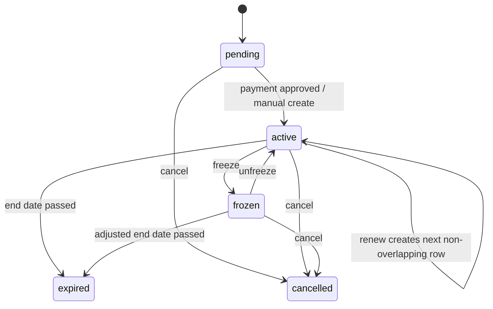

# Money Schema

### `membership_plans`

Club packages.

| Column | Type | Constraints |
|---|---|---|
| `id` | `uuid` | PK default `gen_random_uuid()` |
| `club_id` | `uuid` | not null references `clubs(id)` |
| `name_ar` | `text` | not null |
| `name_en` | `text` | not null |
| `duration_months` | `integer` | nullable, check `> 0` |
| `duration_days` | `integer` | nullable, check `> 0` |
| `price_minor` | `integer` | not null check `>= 0` |
| `currency` | `char(3)` | not null default `EGP` |
| `max_freeze_days` | `integer` | not null default 0, check `>= 0` |
| `max_freeze_count` | `integer` | not null default 0, check `>= 0` |
| `is_active` | `boolean` | not null default true |
| `created_at` | `timestamptz` | not null default `now()` |
| `updated_at` | `timestamptz` | not null default `now()` |

Constraints:
- exactly one of `duration_months` or `duration_days` must be non-null.

Tenant scoped: yes.

Freeze policy:
- Staff with `subscriptions.freeze` can freeze within the package limits.
- Exceeding `max_freeze_days` or `max_freeze_count` requires owner permission, a mandatory reason, and an audit entry.
- A freeze extends `subscriptions.ends_on` by the exact number of frozen Cairo calendar days.
- Freeze override reason is internal. It is visible only to the owner, accountant, staff with `subscriptions.freeze`, and super admins through audit; members see only frozen status, freeze dates, and resume date.
- If a member-facing message is needed, write it to `subscription_freezes.member_visible_note`.
- Member access must use a `security_invoker` view or column-level protection that excludes internal `reason`; it must not rely on UI hiding.
- Freezing is handled in one transaction by `freeze_subscription(...)`:
  1. Lock the target subscription row `for update`.
  2. Lock all later `pending`, `active`, or `frozen` subscriptions for the same `club_member_id` ordered by `starts_on desc, ends_on desc` `for update`.
  3. Validate package freeze days/count limits and owner override permission if needed.
  4. Insert the `subscription_freezes` row.
  5. Shift later subscriptions forward by `days_count`, latest first, updating both `starts_on` and `ends_on`.
  6. Extend the frozen subscription `ends_on` by `days_count`.
  7. Insert audit log and commit.
- The overlap exclusion constraint remains active; latest-first shifting prevents transient overlap without relying on a deferrable constraint.
- Boundary tests must cover within limit, at max freeze days, over limit with staff denial, over limit with owner approval, freeze with queued renewal, two freezes, internal reason visibility, member-visible note visibility, and leap/month-end edges.

### `subscriptions`

Member subscription periods.

| Column | Type | Constraints |
|---|---|---|
| `id` | `uuid` | PK default `gen_random_uuid()` |
| `club_id` | `uuid` | not null references `clubs(id)` |
| `club_member_id` | `uuid` | not null references `club_members(id)` |
| `membership_plan_id` | `uuid` | nullable references `membership_plans(id)` |
| `source_payment_id` | `uuid` | nullable references `payments(id)` |
| `status` | `subscription_status` | not null |
| `starts_on` | `date` | not null |
| `ends_on` | `date` | not null |
| `frozen_from` | `date` | nullable |
| `frozen_until` | `date` | nullable |
| `cancelled_at` | `timestamptz` | nullable |
| `created_by` | `uuid` | nullable references `profiles(id)` |
| `created_at` | `timestamptz` | not null default `now()` |
| `updated_at` | `timestamptz` | not null default `now()` |

Constraints:
- `ends_on >= starts_on`.
- `daterange(starts_on, ends_on + 1, '[)')` exclusion preventing overlap per `club_member_id` for statuses `pending`, `active`, `frozen`.
- unique `(source_payment_id)` where `source_payment_id is not null`; one payment can produce at most one subscription even under concurrent approval.
- end dates are computed as end-of-day in `Africa/Cairo` for display and validity checks; persisted columns remain `date` plus tested Cairo-boundary conversion.

Indexes:
- `(club_id, status, ends_on)`.
- `(club_member_id, starts_on desc)`.

Tenant scoped: yes.

### `subscription_freezes`

Freeze events for subscription history and limit tracking.

| Column | Type | Constraints |
|---|---|---|
| `id` | `uuid` | PK default `gen_random_uuid()` |
| `club_id` | `uuid` | not null references `clubs(id)` |
| `subscription_id` | `uuid` | not null references `subscriptions(id)` |
| `starts_on` | `date` | not null |
| `ends_on` | `date` | not null |
| `days_count` | `integer` | not null check `> 0` |
| `exceeds_plan_limit` | `boolean` | not null default false |
| `reason` | `text` | nullable; required when exceeding plan limit |
| `member_visible_note` | `text` | nullable |
| `approved_by` | `uuid` | nullable references `profiles(id)` |
| `created_by` | `uuid` | not null references `profiles(id)` |
| `created_at` | `timestamptz` | not null default `now()` |

Constraints:
- `ends_on >= starts_on`.
- no overlapping freezes per subscription.

Tenant scoped: yes.

### `payments`

Cash and proof-of-payment records.

| Column | Type | Constraints |
|---|---|---|
| `id` | `uuid` | PK default `gen_random_uuid()` |
| `club_id` | `uuid` | not null references `clubs(id)` |
| `club_member_id` | `uuid` | not null references `club_members(id)` |
| `membership_plan_id` | `uuid` | nullable references `membership_plans(id)` |
| `subscription_id` | `uuid` | nullable references `subscriptions(id)` |
| `method` | `payment_method` | not null |
| `status` | `payment_status` | not null default `pending` |
| `amount_minor` | `integer` | not null check `amount_minor >= 0` |
| `currency` | `char(3)` | not null default `EGP` |
| `reference` | `text` | nullable |
| `proof_path` | `text` | nullable |
| `rejection_reason` | `text` | nullable |
| `reviewed_by` | `uuid` | nullable references `profiles(id)` |
| `reviewed_at` | `timestamptz` | nullable |
| `idempotency_key` | `uuid` | nullable |
| `recorded_by` | `uuid` | nullable references `profiles(id)` |
| `voided_by` | `uuid` | nullable references `profiles(id)` |
| `voided_at` | `timestamptz` | nullable |
| `void_reason` | `text` | nullable |
| `refunded_by` | `uuid` | nullable references `profiles(id)` |
| `created_at` | `timestamptz` | not null default `now()` |
| `updated_at` | `timestamptz` | not null default `now()` |
| `refunded_at` | `timestamptz` | nullable |

Constraints:
- unique `(club_id, idempotency_key)` where `idempotency_key is not null`.
- proof path required for transfer methods.
- `reviewed_by/reviewed_at` required when approved or rejected.
- cash payments are approved immediately when recorded by staff with `payments.record`.
- `amount_minor`, `currency`, `method`, `club_member_id`, and `membership_plan_id` are immutable after insert.
- corrections happen only through void/refund with mandatory reason by owner or accountant.

Tenant scoped: yes.

## Subscription State Machine

### Date function design

Function name: `compute_subscription_period(anchor_date date, duration_months int, duration_days int, previous_ends_on date default null)`.

Rules:
- If renewing an active/future subscription, `starts_on = previous_ends_on + 1`.
- Otherwise `starts_on = anchor_date`.
- If `duration_months` is set, use calendar month addition from `starts_on`, then subtract one day for inclusive end.
- If target month has fewer days, clamp to the last valid day.
- If `duration_days` is set, `ends_on = starts_on + duration_days - 1`.
- Store dates as `date`, not local midnight timestamps.

Edge cases to test:
- January 31 + 1 month => February 28 in non-leap years, February 29 in leap years, inclusive end adjusted.
- February 29 + 12 months.
- Renewal where current subscription ends in future.
- Freeze/unfreeze adding frozen days to `ends_on`.
- Cairo timezone near midnight: UI converts display only; DB date math stays date-based.

## Payment Approval Function

Function names:
- `record_cash_payment(...) returns uuid`: staff with `payments.record` records cash and immediately creates/extends the subscription in the same transaction.
- `approve_transfer_payment(payment_id uuid, reviewer_profile_id uuid, idempotency_key uuid) returns uuid`: owner/accountant/staff with `payments.approve` approves proof-based transfers.
- `void_or_refund_payment(payment_id uuid, reason text, mode text)`: owner or accountant only; mandatory reason; audited.

Transaction flow:
1. Validate caller is authenticated and has the required permission for the payment method.
2. Lock payment row `for update`.
3. If payment is already `approved`, return existing `subscription_id`.
4. Reject if payment is `rejected` or `refunded`.
5. Lock member row and plan row.
6. Compute subscription dates using the single date function and latest active/future subscription.
7. Insert subscription with `source_payment_id = payment.id`, or attach to existing idempotent result if the unique `subscriptions(source_payment_id)` constraint already has the payment.
8. Update payment to `approved`, set `reviewed_by`, `reviewed_at`, `subscription_id`, `idempotency_key`; cash sets these immediately at record time.
9. Insert audit log.
10. Return subscription id.

This prevents double clicks and retries from creating duplicate subscriptions.
The row lock and `subscriptions(source_payment_id)` unique constraint both apply; either one alone is not enough.

Cash reconciliation:
- daily cash summary is computed only from approved non-voided cash payments.
- cash amounts are immutable after recording.
- corrections use void/refund rows/state with mandatory reason; the original payment remains for audit.

